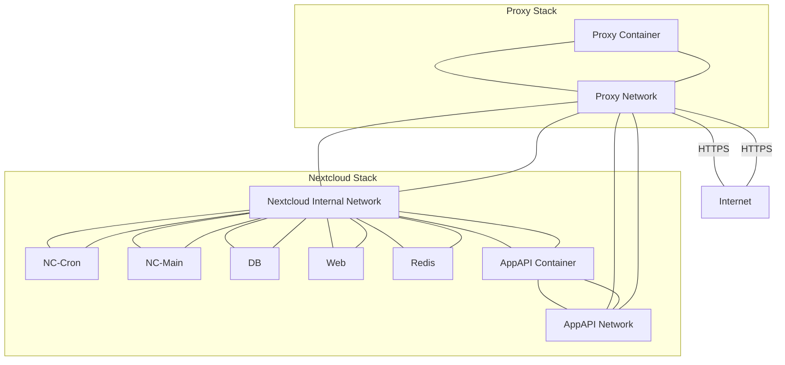

# Nextcloud AppAPI (HaRP) – Docker Compose Example  
(FPM + Nginx + nginx-proxy-manager)

> **Warning**  
> This example is based on a working setup but differs from other examples. Review the differences carefully before adapting it to your environment.

This document provides a minimal example of running the AppAPI container required for Nextcloud 32 or newer using Docker Compose.

The setup assumes:

- `nginx-proxy-manager` as the external reverse proxy  
- `nginx` + `php-fpm` (FPM variant of Nextcloud)  
- A dedicated external proxy network  

This configuration differs from other examples because it uses a separate proxy network. Review the network definitions carefully before deploying.

This example must be significantly adapted if you intend to run Nextcloud with Apache.

AppAPI requires Poetry. This example includes a modified Dockerfile that installs Poetry on top of the stable FPM image. It has been tested with:

- `nextcloud:32.0.6-fpm`

Additional information about AppAPI can be found in the official documentation:

https://docs.nextcloud.com/server/latest/admin_manual/exapps_management/AppAPIAndExternalApps.html

The Poetry installer script is taken from:

https://install.python-poetry.org/

This example uses the latest `stable-fpm` variant of Nextcloud.

Contributions and improvements are welcome.

---

# Dockerfile

```Dockerfile
FROM nextcloud:stable-fpm

RUN apt-get update && apt-get install -y python3.13-venv pipx

ADD ./poetry.sh /tmp/poetry.sh

USER www-data
RUN pipx ensurepath
RUN python3 /tmp/poetry.sh

USER root
```

This Dockerfile:

- Extends the `stable-fpm` image
- Installs Python venv support and `pipx`
- Installs Poetry as the `www-data` user
- Switches back to `root` for standard container behavior

---

# Docker Compose Example

```yaml
services:
  db:
    image: postgres:16-alpine
    restart: unless-stopped
    volumes:
      - db:/var/lib/postgresql/data:Z
    environment:
      - POSTGRES_PASSWORD=CHANGEME
      - POSTGRES_DB=nextcloud
      - POSTGRES_USER=nextcloud

  app:
    build: ./
    restart: unless-stopped
    volumes:
      - nextcloud:/var/www/html
      - /var/run/docker.sock:/var/run/docker.sock
    networks:
      - default
      - appapi
    environment:
      - REDIS_HOST=redis
      - POSTGRES_HOST=db
      - POSTGRES_PASSWORD=CHANGEME
      - POSTGRES_DB=nextcloud
      - POSTGRES_USER=nextcloud
    depends_on:
      - db
      - redis

  redis:
    image: redis:alpine
    restart: unless-stopped

  web:
    image: nginx:alpine
    restart: unless-stopped
    hostname: web
    volumes:
      - nextcloud:/var/www/html:ro
      - ./nginx.conf:/etc/nginx/nginx.conf:ro # https://docs.nextcloud.com/server/latest/admin_manual/installation/nginx.html
    expose:
      - 80
    depends_on:
      - app
    networks:
      - default
      - proxy
      - appapi

  cron:
    build: ./
    restart: unless-stopped
    networks:
      - default
      - appapi
    volumes:
      - nextcloud:/var/www/html
    entrypoint: /cron.sh
    depends_on:
      - db
      - redis
  
  appapi:
    platform: linux/amd64
    container_name: appapi
    hostname: appapi
    privileged: true
    image: ghcr.io/nextcloud/nextcloud-appapi-harp:release
    networks:
      - proxy
      - appapi
    restart: unless-stopped
    depends_on:
      - app
    # env_file:
    #   - appapi.env
    environment:
      # NC_HAPROXY_PASSWORD needs to be at least 12 chars long. This variable exists for backward compatibility with the DSP image
      # ToDo: verify whether this variable is still required
      - NC_HAPROXY_PASSWORD=CHANGEME1234
      # HP_SHARED_KEY needs to be at least 12 chars long.
      - HP_SHARED_KEY=CHANGEME1234
      # NC_INSTANCE_URL must be the externally accessible URL of the Nextcloud instance
      - NC_INSTANCE_URL=https://external-nextcloud.url
    volumes:
      - /var/run/docker.sock:/var/run/docker.sock

volumes:
  db:
  nextcloud:

networks:
  proxy: # This is an external network created for nginx-proxy-manager used by this setup. It must be edited to match your environment.
    name: proxy-manager_proxy_network
    external: true

  appapi: # This network is required in order for AppAPI to function correctly. Using "host" networking as in some examples may fail.
    name: appapi_network
```

---

# Architecture Overview

_Mermaid diagrams may render inconsistently depending on the viewer._



---

# Nextcloud AppAPI Daemon Configuration

To make the above compose file functional, configure the daemon in the Nextcloud admin interface.

Navigate to:

**Admin Settings → AppAPI → Register Daemon**

## Base Configuration

| Field | Value |
|--------|--------|
| Daemon configuration template | HaRP Proxy (Docker) |
| Name | harp_proxy_host |
| Display name | HaRP Proxy (Host) |
| Deployment method | docker-install |
| HaRP host | appapi:8780 |
| HaRP shared key | Value of `HP_SHARED_KEY` |
| Nextcloud URL | Value of `NC_INSTANCE_URL` |
| Set as default daemon | Enabled |

Click **Show Deploy Config**, then configure:

## Deploy Configuration

| Field | Value |
|--------|--------|
| Enable HaRP | Enabled |
| FRP server address | appapi:8782 |
| Docker socket proxy port | 24000 |
| Disable FRP | Disabled |
| Docker network | appapi |
| Compute device | CPU |

After completing the configuration:

1. Click **Check Connection**
2. Verify the connection succeeds
3. Click **Register**

---

# Validation

After registering the daemon:

1. Start a test deployment from the AppAPI interface.
2. The deployment should complete within approximately 2–3 minutes.

---

# Intended Audience

This example assumes:

- Familiarity with Docker Compose
- Understanding of reverse proxy networking
- Knowledge of FPM-based Nextcloud deployments
- Ability to adapt networks and environment variables to existing infrastructure

This is not intended as a beginner-level guide.