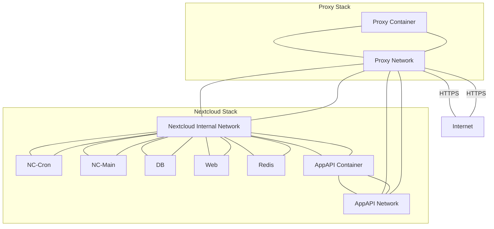

# Nextcloud AppAPI (HaRP) – Docker Compose Example  
(FPM + Nginx + nginx-proxy)

> **Warning**  
> This example is based on a working setup but differs from other examples. Review the differences carefully before adapting it to your environment.

This document provides a minimal example of running the AppAPI container required for Nextcloud 32 or newer using Docker Compose.

This example must be significantly adapted if you intend to run Nextcloud with Apache.

AppAPI requires Poetry. This example includes a modified Dockerfile that installs Poetry on top of the stable FPM image. It has been tested with:

- `nextcloud:32.0.6-fpm`

Additional information about AppAPI can be found in the official documentation:

https://docs.nextcloud.com/server/latest/admin_manual/exapps_management/AppAPIAndExternalApps.html

The Poetry installer script is taken from:

https://install.python-poetry.org/

This example uses the latest `stable-fpm` variant of Nextcloud.

Contributions and improvements are welcome.

---

# Dockerfile

```Dockerfile
FROM nextcloud:stable-fpm

RUN apt-get update && apt-get install -y python3.13-venv pipx

ADD ./poetry.py /tmp/poetry.py

USER www-data
RUN pipx ensurepath
RUN python3 /tmp/poetry.py

USER root
```

This Dockerfile:

- Extends the `stable-fpm` image
- Installs Python venv support and `pipx`
- Installs Poetry as the `www-data` user
- Switches back to `root` for standard container behavior

---

# Docker Compose Example

```yaml
services:
  # Note: PostgreSQL is an external service. You can find more information about the configuration here:
  # https://hub.docker.com/_/postgres
  db:
    image: postgres:18-alpine
    # Note: Check the recommend version here: https://docs.nextcloud.com/server/latest/admin_manual/installation/system_requirements.html#server
    restart: always
    volumes:
      - db:/var/lib/postgresql/data:Z
    environment:
      - POSTGRES_PASSWORD=CHANGEME
      - POSTGRES_DB=nextcloud
      - POSTGRES_USER=nextcloud

  app:
    build: ./
    restart: always
    volumes:
      - nextcloud:/var/www/html:Z
      - /var/run/docker.sock:/var/run/docker.sock
    networks:
      - default
      - appapi
    environment:
      - REDIS_HOST=redis
      - POSTGRES_HOST=db
      - POSTGRES_PASSWORD=CHANGEME
      - POSTGRES_DB=nextcloud
      - POSTGRES_USER=nextcloud
    depends_on:
      - db
      - redis

  # Note: Redis is an external service. You can find more information about the configuration here:
  # https://hub.docker.com/_/redis
  redis:
    image: redis:alpine
    restart: always
  
  # Note: Nginx is an external service. You can find more information about the configuration here:
  # https://hub.docker.com/_/nginx/
  web:
    image: nginx:alpine
    restart: always
    hostname: web
    volumes:
      - nextcloud:/var/www/html:z,ro
      - ./nginx.conf:/etc/nginx/nginx.conf:ro # https://docs.nextcloud.com/server/latest/admin_manual/installation/nginx.html
    environment:
      - VIRTUAL_HOST=
      - LETSENCRYPT_HOST=
      - LETSENCRYPT_EMAIL=
    depends_on:
      - app
    networks:
      - default
      - proxy-tier
      - appapi
  
  # Note: Nginx-proxy is an external service. You can find more information about the configuration here:
  # Warning: Do not use :latest tags of nginx-proxy unless absolutely sure about the consequences.
  # https://hub.docker.com/r/nginxproxy/nginx-proxy
  proxy:
    build: ./proxy
    restart: always
    ports:
      - 80:80
      - 443:443
    labels:
      - "com.github.jrcs.letsencrypt_nginx_proxy_companion.nginx_proxy"
    volumes:
      - certs:/etc/nginx/certs:z,ro
      - vhost.d:/etc/nginx/vhost.d:z
      - html:/usr/share/nginx/html:z
      - /var/run/docker.sock:/tmp/docker.sock:z,ro
    networks:
      - proxy-tier

  # Note: Letsencrypt companion is an external service. You can find more information about the configuration here:
  # https://hub.docker.com/r/nginxproxy/acme-companion
  letsencrypt-companion:
    image: nginxproxy/acme-companion
    restart: always
    volumes:
      - certs:/etc/nginx/certs:z
      - acme:/etc/acme.sh:z
      - vhost.d:/etc/nginx/vhost.d:z
      - html:/usr/share/nginx/html:z
      - /var/run/docker.sock:/var/run/docker.sock:z,ro
    environment:
      - DEFAULT_EMAIL=
    networks:
      - proxy-tier
    depends_on:
      - proxy

  cron:
    build: ./
    restart: always
    networks:
      - default
      - appapi
    volumes:
      - nextcloud:/var/www/html:z
      # NOTE: The `volumes` config of the `cron` and `app` containers must match
    entrypoint: /cron.sh
    depends_on:
      - db
      - redis
  
  appapi:
    platform: linux/amd64
    container_name: appapi
    hostname: appapi
    privileged: true
    image: ghcr.io/nextcloud/nextcloud-appapi-harp:release
    networks:
      - proxy-tier
      - appapi
    restart: always
    depends_on:
      - app
    environment:
      # NC_HAPROXY_PASSWORD needs to be at least 12 chars long. This variable exists for backward compatibility with the DSP image
      # ToDo: verify whether this variable is still required
      - NC_HAPROXY_PASSWORD=CHANGEME1234
      # HP_SHARED_KEY needs to be at least 12 chars long. 
      - HP_SHARED_KEY=CHANGEME1234
      # NC_INSTANCE_URL must be the externally accessible URL of the Nextcloud instance
      - NC_INSTANCE_URL=https://external-nextcloud.url
    volumes:
      - /var/run/docker.sock:/var/run/docker.sock

volumes:
  db:
  nextcloud:
  certs:
  acme:
  vhost.d:
  html:

networks:
  proxy-tier: 
  appapi:
```

---

# Architecture Overview

_Mermaid diagrams may render inconsistently depending on the viewer._



---

# Nextcloud AppAPI Daemon Configuration

To make the above compose file functional, configure the daemon in the Nextcloud admin interface.

Navigate to:

**Admin Settings → AppAPI → Register Daemon**

## Base Configuration

| Field | Value |
|--------|--------|
| Daemon configuration template | HaRP Proxy (Docker) |
| Name | harp_proxy_host |
| Display name | HaRP Proxy (Host) |
| Deployment method | docker-install |
| HaRP host | appapi:8780 |
| HaRP shared key | Value of `HP_SHARED_KEY` |
| Nextcloud URL | Value of `NC_INSTANCE_URL` |
| Set as default daemon | Enabled |

Click **Show Deploy Config**, then configure:

## Deploy Configuration

| Field | Value |
|--------|--------|
| Enable HaRP | Enabled |
| FRP server address | appapi:8782 |
| Docker socket proxy port | 24000 |
| Disable FRP | Disabled |
| Docker network | appapi |
| Compute device | CPU |

After completing the configuration:

1. Click **Check Connection**
2. Verify the connection succeeds
3. Click **Register**

---

# Validation

After registering the daemon:

1. Start a test deployment from the AppAPI interface.
2. The deployment should complete within approximately 2–3 minutes.

---

# Intended Audience

This example assumes:

- Familiarity with Docker Compose
- Understanding of reverse proxy networking
- Knowledge of FPM-based Nextcloud deployments
- Ability to adapt networks and environment variables to existing infrastructure

This is not intended as a beginner-level guide.