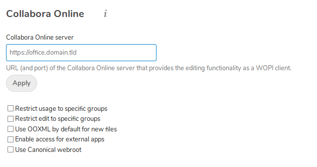

This docker-compose.yml file will create a nextcloud instance with signed certs using the lets encrypt companion and the nginx reverse proxy.  Collabora office will also be deployed using signed certs. To use collabora the app must be installed within nextcloud and configured to use office.DOMAIN.TLD.  

There is no need to specify a port, simply the pubilc domain used to create your certs for the office instance.  Ports, 443 and 80 should be forwarded to the server.

